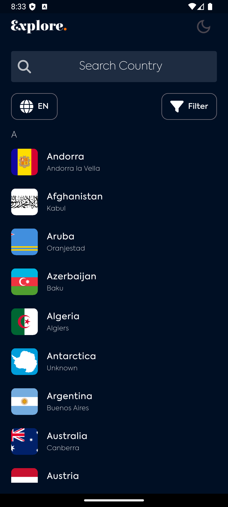
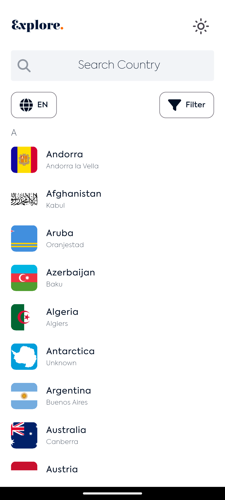
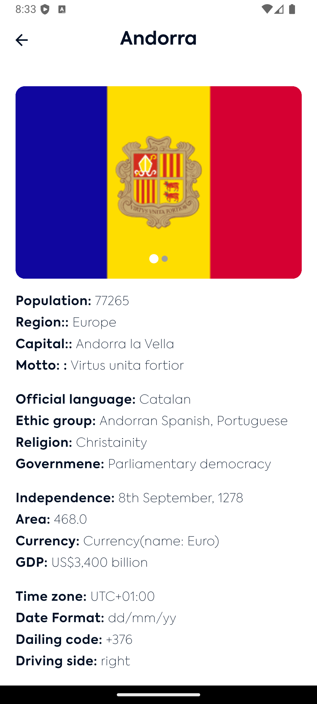
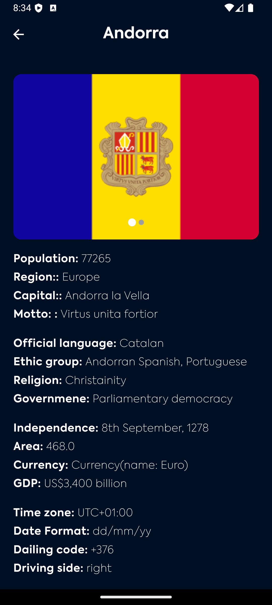

# 🌍 Country Info App with Theme Customization  

## 📖 Description  
The **Country Info App** is a mobile application built with Flutter that allows users to explore and view detailed information about countries around the world. The app supports **light and dark themes** and offers a responsive design for a seamless experience across different devices.  

Users can search for countries, view their flag, population, capital, continent, and other details, and toggle between themes with a single tap. The app is deployed on **Appetize.io**, making it easy to test directly in a browser.  

---

## 🚀 Key Features  

### 🌏 Country List  
- Fetches and displays a list of countries from the Country API.  
- Includes a search bar to filter countries by name.  

### 🗺️ Country Details  
- Displays the following information about a selected country:  
  - Name  
  - Flag  
  - Country code  
  - Capital city  
  - Population  
  - Continent  
  - Current president (if available)  
  - States/provinces (if applicable)  
- "Back" button to return to the country list.  

### 🎨 Theme Customization  
- Supports **light** and **dark** themes.  
- The theme is applied across all UI components (backgrounds, text, buttons, etc.).  

### 📱 Responsive Design  
- Optimized for various screen sizes and device types.  

### 🌐 App Deployment  
- Hosted on **Appetize.io** for easy access and testing on different devices and browsers.  

---
## Screenshots

- 
- 
- 
- 


## 🛠 Tech Stack  
- **Framework:** Flutter  
- **State Management:** Riverpod  
- **API:** Country API  

---

## Installation

1. **Clone the repository**:
    ```bash
    git clone https://github.com/Luckystartech/GitGo.git
    cd gitgo_app
    ```

2. **Install dependencies**:
    ```bash
    flutter pub get
    ```

3. **Run the app**:
    ```bash
    flutter run
    ``

## 📂 Project Structure  
```bash
lib  
 ├── features/  
 │   ├── data/          # Data layer (API integration, models)  
 │   ├── domain/        # Business logic  
 │   └── presentation/  # UI components (screens, widgets)  
 ├── theme/       # theme settings  
 └── main.dart          # Entry point  

## Contact

If you have any questions or suggestions, feel free to reach out to me at [gmail](luckyekpebe123@gmail.com).


